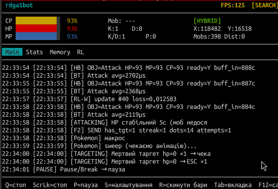
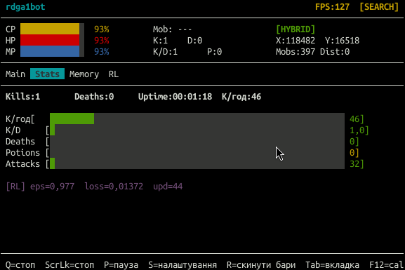
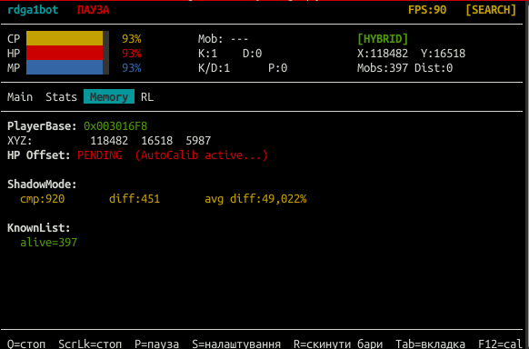
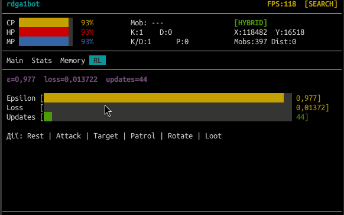

# rdga1bot — v1.5

C++ бот для автоматизації фарму в Lineage II.  
Протестовано: ElmoreLab Kamael/Lionna, Arch Linux, Wine/Lutris (GE-Proton), X11.

## TUI Dashboard (htop-style)

| Main — лог подій | Stats — метри |
|---|---|
|  |  |

| Memory — offsets + Shadow | RL — Q-model |
|---|---|
|  |  |

**Керування:**
- Клік мишею по вкладці — перемикання Main / Stats / Memory / RL
- `Fn+Home` (ScrollLock) — зупинка бота
- `Fn+PgUp` (Pause/Break) — пауза / відновлення

## Результати (v1.5)

| Сесія | Kills | Deaths | Kill/хв |
|-------|-------|--------|---------|
| **137 хв (MR76+)** | **640** | **0** | **4.7** |
| 252 хв (MR77+) | 732 | 1* | 2.9 |
| 311 хв (MR75) | 921 | 0 | 3.0 |
| 182 хв (MR76) | 1072 | 1 | 5.9 |
| Тиждень (~54 сесії, v1.1) | ~15 700 | — | 4–15 |

\* D-лічильник v1.4 хибно показував множинні смерті через OCR HP=1% (MR79 fix)

Ціль: **kill rate > 3/хв стабільно** — стабільно досягнуто, найкраща сесія 4.7 kills/хв за 137 хв без смертей.

---

## Можливості

### Бойовий цикл
- Автоматичний пошук і атака мобів через `/nexttarget` (F2) і `/target МобНейм` макроси
- Детекція смерті моба: OpenCV HP bar + KnownList memory read (instant, без debounce)
- Watchdog таймаут — перехід до лутингу якщо kill не детектується
- Pokemon sweep: `/target Pokemon` + `/useshortcut` після кожного kill
- Blacklist недосяжних мобів: HP-stable 5с → автоматичне блокування на 60с
- **MR50**: `m_atk_unreachable_streak` — після 5 unreachable без kills → форсуємо повний цикл (Pokemon + patrol), ігноруючи minimap_close_threat
- **MR51**: `m_atk_streak_force_count` — після 3 force-циклів (~75с) → ESC + `has_target=false` → patrol фізично переміщує бота (break 20хв Pokemon-loop)
- **MR52**: `condNeedsRest` не відпочиває < 15с після kill; `hp_threshold` 70%→45% (TH Vampiric Rage лікується атакуючи)
- **MR60/61**: фікс false `stuck_streak3` під час активного DPS — `m_atk_mem_hp_abs` завжди оновлюється; вибір KL-моба по hp% match (±15%) з fallback на nearest
- **MR75/76**: dx stability tracking — WalkForward при stuck dx ×3 (без IsGroundAhead); buff під час grace period (`m_buff_after_death`) — єдине безпечне вікно в зоні агресивних мобів
- **MR76**: `m_close_unreachable_count` — max 3 "close on minimap but unreachable" скидань streak → force cycle + `WalkForward(4000)` при force#3 (вихід зі stuck zone за стіною)

### Навігація
- Мінімапа Rotating Radar: детекція червоних/фіолетових точок мобів, ротація до цілі
- WalkForward по мінімапі (dy-based) + прогресивна ротація при застряганні
- Патруль PatrolPath (`F2000,R500,...`) при порожній мінімапі
- Memory-based навігація: координати XYZ + heading (`[Navigation] Enabled=true`)
- NavMesh Recast/Detour: `[NavMesh] Enabled=true` + зібрані точки руху
- **MR65**: force escape після >20с без руху в Target state (антизастрявання у стін + "Ціль не видно")

### Memory Reading (KnownList + MemReader)
- `process_vm_readv` — без root, без Cheat Engine, без Windows API
- `blindScan()` — автономний пошук PlayerBase; atomic abort при таймауті
- Region scan heap: XYZ triplet scan → тип/HP/isDead/ім'я/level (KL_MAX_OBJECTS=2000)
- HP читання (MR43): render_node+0x58 → game_obj → +0x14 = HP (uint32, NOT float)
- **MR53 UseKLBase**: MemReader отримує `playerBase` від KnownList без статичного `PlayerPtr`; `PosX/Y/Z=0x24/0x28/0x2C` → координати гравця з пам'яті без Cheat Engine
- **MR54 AutoCalibrate**: `AutoCalibratePlayer()` сканує `playerBase+0x00..0x300`, знаходить HP/MP/CP offsets через порівняння з OCR%; результат → `mem_calib.json` (автозавантаження при наступному старті)
- **ShadowMode**: логує порівняння OCR vs Memory (`[MemCalib]`, `[KL-HP]`) — діагностика без зупинки
- Thread-safe WorldState (snapshot copy під mutex, bgLoop scan кожну 1с)
- `--dump-objects` / `--calibrate [--name "X"]` / `--hp-calibrate` / `--watch-pos` — калібровка без Cheat Engine
- **MR70 Offsets**: `OFF_OBJ_X/Y/Z=0x24/28/2C` від playerBase (підтверджено `--watch-pos`); region scan `0x300000-0x350000` (підтверджено `--find-pos`, stride=0x5C0)
- **MR71 Cleanup**: вилучено непідтверджені offsets (NAME/LEVEL/MP=0) і мертвий код (readAllAsChars, readItemsRegionScan, OFF_OBJ_TYPE фільтр); реальні фільтри: XYZ + HP через render_node + dist<100
- **MR72**: `safePct()` guardrail (memory HP поза [0,100] → OCR fallback); `[Shadow]` spam fix (лог один раз); видалено false-positive mem_calib.json
- **MR73**: WalkForward вилучено з GeoNav (root cause: KL-HP false positives → крокував від моба); HP filter `500k→2k` (hpAbs=70 підтверджено)
- **MR74**: crash при shutdown — `std::thread::detach()` blindScan → use-after-free; fix: stored thread + `abortScan()` + join при `bot_exit`
- **MR75**: dx stability tracking у `tgtHandleMinimap` (WalkForward bypass при stuck dx ×3); KL-HP фільтр `absHp<10 && hpMax=0` (false positive hpAbs=3 → 139 false unreachable); Shadow counter fix; HP_Threshold 70→45%
- **MR76**: buff під час grace якщо `m_buff_after_death` (fix death loop після смерті без бафів); `m_close_unreachable_count` ліміт 3 + force#3 `WalkForward(4000)` (fix 17-хв gap з 14 недосяжними мобами); crash fix — `SetLogCallback(nullptr)` перед `dashboard.Shutdown()` (double free)
- **MR77**: KL-HP фільтр dist>5000 → виключаємо garbage coords (false positive dist=112456 з region scan)
- **MR78**: `--diff-scan` — двофазне калібрування HP/MP/CP без Cheat Engine (snapshot 1 → урон → snapshot 2 → diff → `mem_calib.json`)
- **MR79**: `RecordDeath()` перенесено в `actDead` Фаза 0 (виконується рівно 1 раз/смерть); fix хибного D-лічильника при HP=1% (TH Vampiric Rage → multiple false triggers)
- **MR80**: HP гравця з пам'яті **підтверджено в бойових умовах** без Cheat Engine:
  - Якір DSETUP.dll: `*(0x1003F27C) - 0x3DC8 = struct_base` → `+0x00=max_hp`, `+0x08=cur_hp`
  - Pointer стабільний впродовж всієї сесії фарму; TUI: `CONFIRMED hp=12874/15202`
  - `HpAutoCalib` full-process scan fallback: сканує всі r-w регіони `/proc/pid/maps`, знаходить HP пари диференційно (без Cheat Engine), зберігає абсолютні адреси → `mem_calib.json`
  - ReadPlayer пріоритет: `hp_abs` (scan result) > `hp_anchor_addr` (DLL anchor) > `hp_off` (game_obj)
- **Windows**: `ReadProcessMemory` (ProcessMemory.h), Toolhelp32 (FindPid), `EnumProcessModules` (FindModuleBase), `VirtualQueryEx` (region scan) — MR67

### BehaviorTree планувальник
- Stackless BT VM: `BTNode` (24 bytes), `BTState` (8 bytes), плоскі масиви — без heap, без рекурсії
- Гілки: Dead → Rest → Zone → Buff → Loot → Attack → Target Selector (~22 вузли)
- Target піддерево (MR28): Init → DeadTarget → Minimap → F2AndMacro → Navigation → GeoPath → Patrol
- `thread_local s_self` — static Action/Condition функції безпечно звертаються до стану
- GoogleTest suite: `tests/bt_test.cpp` + `tests/memory_test.cpp` (`make -C tests run`)

### Huber Q-Learning / RL (`[Learning] Enabled=true` за замовчуванням)
- Лінійна Q-функція: `Q(s,a) = W[:,a]^T * phi(s)`, 10 ознак × 6 дій
- IRLS з Huber-вагами — стійко до рідкісних смертей (викиди в reward)
- Async LearningWorker: IRLS в окремому потоці, не блокує main loop
- Epsilon-greedy exploration: `epsilon` від 1.0 до 0.05
- Ваги зберігаються в `weights.json`, автоматично завантажуються при старті

### Input Backend (XSendEvent Hybrid, MR66/68)
- Keyboard events → `XSendEvent(XKeyEvent)` напряму до вікна гри (не глобальний grab)
- Mouse buttons → `XTestFakeButtonEvent` (MR68: Wine ігнорує XSendEvent ButtonPress)
- Mouse move → XTest (DirectInput ігнорує XSendEvent MotionNotify)
- Переключення: `[Input] Backend = hybrid | xtest | xsendevent` в INI
- ScrollLock зупинка: `XQueryKeymap` читає фізичний стан клавіатури — не залежить від бекенду
- Результат: можна використовувати мишу/клавіатуру паралельно з ботом

### QA Monitor
- `launch_qa.sh` — єдиний скрипт запуску: бот + frame capture + video record
- `qa/frame_capture.py` — зовнішній демон: tail session log → scrot при ключових подіях
- `qa/video_record.py` — ffmpeg x11grab запис + нарізка кліпів по лог-подіям
- `qa/qa_monitor.py` — IsolationForest аномалії, death_loop, kl_hp_spike
- Бот не знає про QA — принцип розділення відповідальності

### Windows Port (MR66-67)
- `platform.h` — централізовані типи: `pid_t`, `ssize_t` (POSIX / Windows)
- `ProcessMemory.h` — `ReadProcessMemory` на Windows, `process_vm_readv` на Linux
- `MemReader.cpp` — Toolhelp32 `FindPid` + `EnumProcessModules` `FindModuleBase`
- `offset_scanner.cpp` / `knownlist_reader.cpp` — `VirtualQueryEx` замість `/proc/maps`
- `Notify.cpp` — `CreateProcess curl.exe` замість `fork/execv`
- `Capture.cpp`, `Window.cpp` — GDI BitBlt + EnumWindows (вже існували)
- `Intercept.cpp` — interception.dll kernel-mode driver (вже існував)
- `CMakeLists.txt` — cross-platform: Linux (`X11 Xtst ncurses`) / Windows (`psapi interception PDCurses`)

### Антидетект
- RandomDelay: нормальний розподіл затримок між атаками, поворотами, ходьбою
- Конфігурується через `[Delays]` в INI (mean±std мс, `Enabled=false` за замовчуванням)

---

## Швидкий старт

```bash
# Залежності (Arch Linux)
sudo pacman -S opencv gcc libx11 libxtst libxext curl ncurses

# Зібрати
bash build.sh

# Запуск
./launch.sh          # TUI налаштувань
./rdga1bot --quick   # без TUI (rdga1bot.ini)
```

## Конфігурація

Копіювати `rdga1bot.example.ini` → `rdga1bot.ini`.

```ini
[Learning]
Enabled = true        # Huber Q-Learning увімкнено за замовчуванням

[KnownList]
Enabled = true
AutoScan = true       # автоматичний blindScan PlayerBase

[MemReader]
Enabled = true
UseKLBase = true      # координати з playerBase (без Cheat Engine)
PosX_Offset = 0x24
PosY_Offset = 0x28
PosZ_Offset = 0x2C
ShadowMode = true     # логувати OCR vs Memory порівняння
# HP/MP/CP offsets знаходяться автоматично при першому запуску → mem_calib.json

[Potions]
HpThreshold = 45      # відпочинок тільки при < 45% HP (TH Vampiric Rage)
```

Повний список: [`rdga1bot.example.ini`](rdga1bot.example.ini)

## Калібровка

```bash
# Двофазне авто-калібрування HP/MP/CP (MR78):
./rdga1bot --diff-scan
# → Snapshot 1 (введи HP%/MP%/CP%), отримай урон, Enter → Snapshot 2 → mem_calib.json

# Ручна діагностика:
./rdga1bot --calibrate              # дамп KnownList об'єктів
./rdga1bot --calibrate --name "Mob" # пошук по імені
./rdga1bot --hp-calibrate           # пошук HP offset мобів
./rdga1bot --find-pos               # пошук PlayerBase XYZ offset
./rdga1bot --watch-pos              # live monitor XYZ при русі
```

## Клавіші

| Клавіша | Дія |
|---------|-----|
| ScrollLock | Зупинити бот (глобально) |
| P | Пауза / продовження |
| S | Налаштування (hot-reload) |
| R / Space | Скинути детекцію HP/MP/CP барів |
| F12 | Зберегти calibrate_*.png |

## Рефакторинг R1 (2026-04)

Без змін логіки, тільки структура:

| До | Після |
|----|-------|
| `BotBehaviorTree.cpp` 1764 рядки | 273 + 6 файлів `BotBT_*.cpp` |
| `main.cpp` 2442 рядки | 774 + 6 файлів `src/tools/diag_*.cpp` |
| `GameState`: 7 плоских `std::function<>` | `struct Callbacks { } cb` (доступ `gs.cb.X`) |

Діагностичні режими (`--calibrate`, `--diff-scan`, `--map` тощо) виділені в `src/tools/`.  
Три критичних інваріанти задокументовані в коді (s_self thread_local, BFS init, condIsDead+grace).

## Архітектура

```
Brain.cpp/.h              — диспетчер: сприйняття + потіони + BotBehaviorTree dispatch
BehaviorTree.h/.cpp       — stackless BT VM (BTNode 24B, BTState 8B)
BotBehaviorTree.h/.cpp    — Farm BT ctor/init/tick/reset/conditions (~273 рядки)
BotBT_Dead.cpp            — actDead, actRest, actZone, actLoot
BotBT_Buff.cpp            — actBuff (ALT+B FSM, template matching)
BotBT_Attack.cpp          — actAttack, resetAttackState, resetTargetState, blacklist
BotBT_Target.cpp          — Target піддерево (7 вузлів + tgt helpers)
BotBT_Nav.cpp             — deliverGeoPath, addCrumb, takePendingPathRequest
BotBT_RL.cpp              — initRL, shutdownRL, rlPreTick, rlPostTick
src/tools/diag.h          — forward declarations CLI-діагностики
src/tools/diag_*.cpp      — --calibrate, --diff-scan, --map, --find-pos тощо
Eyes.cpp/.h               — OpenCV детекція: HP/MP/CP бари, target HP, мінімапа
Hands.h                   — дії: keyboard/mouse через Intercept
Intercept.h               — cross-platform input interface
Intercept_Linux.cpp       — XSendEvent hybrid backend (MR66)
Intercept.cpp             — Windows: interception.dll kernel-mode driver
platform.h                — pid_t/ssize_t для Linux і Windows (MR66)
ProcessMemory.h           — process_vm_readv (Linux) / ReadProcessMemory (Windows, MR67)
Config.cpp/.h             — INI парсер + валідація + interactive TUI
Dashboard.cpp/.h          — ncurses / PDCurses TUI
MemReader.cpp/.h          — HP/MP/CP/XYZ гравця; UseKLBase + AutoCalibratePlayer (MR53/54)
OffsetScanner             — blindScan + VirtualQueryEx (Windows, MR67)
KnownListReader           — region scan мобів; VirtualQueryEx (Windows, MR67)
WorldState                — thread-safe агрегатор KnownList
LinearQModel.h/.cpp       — Q(s,a)=W^T*phi(s), IRLS+Huber, 6 дій
LearningWorker.h/.cpp     — async IRLS batch update thread
FeatureExtractor.h        — phi(s): 10 ознак з GameState → Eigen::VectorXf
ShadowLogger.h/.cpp       — A/B Memory vs OCR JSONL лог
launch_qa.sh              — єдиний старт: bot + frame_capture + video_record
qa/qa_monitor.py          — QA daemon: IsolationForest + session filtering (MR49)
qa/frame_capture.py       — зовнішній демон скріншотів при ключових подіях (MR62)
qa/video_record.py        — ffmpeg запис/нарізка сесій (MR63)
CMakeLists.txt            — cross-platform CMake: Linux + Windows (MR67)
```

## Швидкий старт (з QA)

```bash
# Запуск бота + frame capture + video record одним скриптом
./launch_qa.sh

# Зупинка: натиснути ScrollLock в грі або Ctrl+C в терміналі
# Нарізка кліпів з останньої сесії:
python3 qa/video_record.py clip --log logs/session_*.log --video qa/videos/farm_*.mkv
```

## Вимоги

### Linux
- X11 (не Wayland), Wine/GE-Proton (Flatpak Lutris)
- `g++` C++17, OpenCV 4.x, ncurses, libx11, libxtst, libxext
- Python 3.x + scikit-learn + scrot + ffmpeg (QA, опціонально)
- googletest (тести, опціонально)

### Windows (нативний порт, MR66-67)
- Windows 10 x64 (нативний L2 клієнт, без Wine)
- MSVC 2022 або MinGW-w64 (g++ -D_WIN32), C++17
- OpenCV 4.x prebuilt, [interception driver](https://github.com/oblitum/Interception) (встановити з правами адмін)
- PDCurses (опціонально, для TUI)
- curl.exe (вбудовано в Windows 10 1803+)

```bash
# Windows CMake збірка:
set INTERCEPTION_DIR=C:\interception
cmake -B build -G "Visual Studio 17 2022" .
cmake --build build --config Release
```
